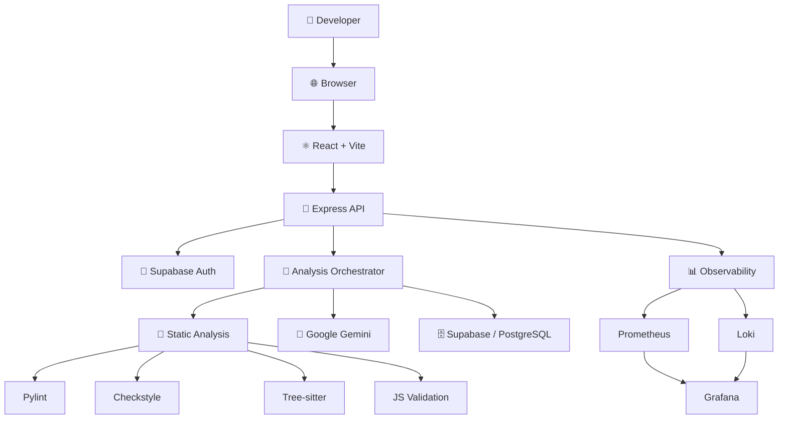

<div align="center">

# 🔍 Logic Lens

### AI-Powered Code Review for Real-World Engineering Teams

Analyze code with **AI reasoning + deterministic static analysis** to catch bugs, security vulnerabilities, maintainability issues, and code-quality problems before they reach production.

<br/>

[](https://nodejs.org/)
[](https://react.dev/)
[](https://expressjs.com/)
[](https://supabase.com/)
[](https://docs.docker.com/compose/)
[](https://ai.google.dev/)
[](https://prometheus.io/)
[](https://grafana.com/)

<br/>

[**📦 Repository**](https://github.com/Mohdkhaleelullah/Logic-Lens-production)
  •  
[**🐛 Issues**](https://github.com/Mohdkhaleelullah/Logic-Lens-production/issues)
  •  
[**🤝 Contributing**](CONTRIBUTING.md)

</div>

---

## 📌 Overview

**Logic Lens** is a full-stack AI-powered code review platform designed to help developers and engineering teams identify problems earlier in the development lifecycle.

Instead of relying exclusively on an LLM or traditional linters, Logic Lens combines:

* 🤖 **AI-powered contextual reasoning**
* 🔎 **Deterministic static analysis**
* 🔐 **Security-focused code inspection**
* 👥 **Team collaboration workflows**
* 📊 **Production observability**

This hybrid approach allows Logic Lens to detect both **rule-based code-quality issues** and more contextual problems that require reasoning about the code.

---

## ✨ Key Features

### 🤖 AI-Powered Code Review

Logic Lens uses **Google Gemini** to analyze source code and generate structured review findings.

The AI can identify:

* Logic errors
* Security vulnerabilities
* Potential bugs
* Poor coding practices
* Maintainability concerns
* Architectural issues
* Code smells

Reviews are returned in a structured format so findings can be displayed consistently in the UI.

---

### 🔎 Hybrid Static + AI Analysis

Logic Lens combines deterministic analyzers with AI reasoning.

```text
                    Source Code
                         │
                         ▼
                Analysis Orchestrator
                    │           │
          ┌─────────┘           └─────────┐
          ▼                               ▼
  Static Analysis                    Gemini AI
          │                               │
          │                        Contextual Review
          │                               │
          └──────────────┬────────────────┘
                         ▼
                 Finding Aggregation
                         │
                         ▼
                  Final Code Review
```

### Static Analysis

Depending on the language and review pipeline, Logic Lens can use:

* **Pylint** — Python analysis
* **Checkstyle** — Java analysis
* **Tree-sitter** — syntax and structural analysis
* **Custom JavaScript validation**

The results are combined with Gemini's analysis to provide a broader review.

---

## 🧠 Why Hybrid Analysis?

Traditional static analysis is deterministic and reliable for known patterns, but it can struggle with higher-level context.

LLMs understand context better, but their responses can be inconsistent or produce suggestions that aren't always actionable.

Logic Lens combines both:

| Static Analysis              | AI Analysis                    |
| ---------------------------- | ------------------------------ |
| Deterministic                | Context-aware                  |
| Fast                         | Reasoning-based                |
| Rule-driven                  | Semantic understanding         |
| Excellent for known patterns | Better for complex logic       |
| Low hallucination risk       | Can identify contextual issues |

The goal is to provide developers with **more useful findings without relying entirely on either approach**.

---

## 🔗 GitHub Integration

Logic Lens integrates with GitHub to bring code review closer to the existing development workflow.

Developers can connect their repositories and use Logic Lens to analyze code without manually copying individual files into the application.

```text
GitHub Repository
       │
       ▼
  Logic Lens
       │
       ▼
Static Analysis + Gemini
       │
       ▼
  Review Findings
```

This creates a foundation for future **pull-request-level automated reviews**.

---

## 👥 Team Collaboration

Logic Lens is designed for engineering teams rather than only individual developers.

The platform supports:

* User authentication
* Team onboarding
* Role-aware workflows
* Team dashboards
* Review history
* Collaborative code review

This allows organizations to use the same platform across multiple projects and developers.

---

## 📊 Admin Dashboard

Administrators can monitor team activity and review-related information through a dedicated dashboard.

The dashboard provides visibility into areas such as:

* Team activity
* Code reviews
* Review findings
* Project information
* User/team management

---

## 📈 Production Observability

Logic Lens includes an observability stack for monitoring application health and diagnosing runtime issues.

### Monitoring Stack

```text
Application
     │
     ├──────────────► Prometheus
     │                    │
     │                    ▼
     │                 Grafana
     │
     └──────────────► Loki
                          │
                          ▼
                       Grafana
```

### Prometheus

Used for collecting application and runtime metrics.

### Loki

Used for centralized application logging.

### Grafana

Provides dashboards for visualizing metrics and logs.

This makes it possible to monitor the application beyond simply checking whether the frontend is working.

---

## 🏗️ Architecture



---

## 🛠️ Tech Stack

### Frontend

* React 19
* Vite
* Modern code editor UI
* Dashboard-based interface

### Backend

* Node.js 20 LTS
* Express 5
* REST APIs
* Analysis orchestration

### AI

* Google Gemini
* Structured AI responses
* Fallback/retry handling

### Static Analysis

* Pylint
* Checkstyle
* Tree-sitter
* Custom JavaScript validation

### Database & Authentication

* Supabase
* PostgreSQL
* Supabase Authentication

### DevOps & Observability

* Docker
* Docker Compose
* Prometheus
* Grafana
* Loki

### Integrations

* GitHub

---


# 🚀 Getting Started

## Prerequisites

Make sure you have the following installed:

* Node.js 20+
* npm
* Docker
* Docker Compose
* Git

You will also need:

* A Supabase project
* A Google Gemini API key
* GitHub OAuth credentials if using GitHub integration

---

## 1. Clone the Repository

```bash
git clone https://github.com/Mohdkhaleelullah/Logic-Lens-production.git

cd Logic-Lens-production
```

---

## 2. Configure Environment Variables

Create the required environment files based on the provided examples/documentation.

Typical configuration includes:

```env
GEMINI_API_KEY=your_gemini_api_key

SUPABASE_URL=your_supabase_url
SUPABASE_ANON_KEY=your_supabase_anon_key

GITHUB_CLIENT_ID=your_github_client_id
GITHUB_CLIENT_SECRET=your_github_client_secret
```

> Never commit API keys, OAuth secrets, database credentials, or other sensitive environment variables to Git.

---

## 3. Install Dependencies

Install the frontend and backend dependencies according to the project structure.

```bash
npm install
```

If the project uses separate frontend/backend packages:

```bash
cd client
npm install

cd ../server
npm install
```

---

## 4. Run with Docker

Logic Lens can be run using Docker Compose.

```bash
docker compose up --build
```

To run the services in the background:

```bash
docker compose up -d --build
```

---

## 5. Open the Application

Once the services are running, open the frontend URL configured by the project.

The backend API will run separately and communicate with the React frontend.

---

# 🔌 API

Logic Lens exposes backend APIs for functionality including:

* Authentication
* Code analysis
* AI reviews
* Static analysis
* GitHub integration
* Team management
* Review history
* Monitoring

Detailed API documentation is available in:

📄 [`docs/API.md`](docs/API.md)

---

# 📊 Monitoring

The observability stack can be started using Docker Compose.

Once running, Grafana can be used to inspect:

* Application metrics
* Request activity
* Error rates
* Runtime behaviour
* Application logs
* Service health

For detailed monitoring configuration:

📄 [`docs/MONITORING.md`](docs/MONITORING.md)

---

# 🔐 Security

Logic Lens is designed with security considerations around:

* Authentication
* Authorization
* Environment secrets
* API access
* GitHub OAuth
* Database access
* Input validation

For more information:

📄 [`docs/SECURITY.md`](docs/SECURITY.md)

---

# 📚 Documentation

| Document                               | Description                                    |
| -------------------------------------- | ---------------------------------------------- |
| [Architecture](docs/ARCHITECTURE.md)   | System architecture and component interactions |
| [API Documentation](docs/API.md)       | Backend API reference                          |
| [Deployment Guide](docs/DEPLOYMENT.md) | Deployment and infrastructure instructions     |
| [Monitoring Guide](docs/MONITORING.md) | Prometheus, Loki and Grafana setup             |
| [Security Guide](docs/SECURITY.md)     | Security considerations and configuration      |
| [Contributing](CONTRIBUTING.md)        | Contribution guidelines                        |

---

# 🗺️ Roadmap

### Code Intelligence

* Improve review accuracy
* Better prompt and context management
* More precise finding prioritization
* Smarter duplicate-finding detection

### Developer Workflow

* Pull-request level automated reviews
* Stronger CI/CD integration
* Improved GitHub workflows
* Review history and analytics

### Language Support

* Expand supported programming languages
* Add additional static analyzers
* Improve language-specific analysis

### Performance

* Result caching
* Faster analysis pipelines
* Improved AI fallback handling
* Team-level analytics

---

# 🤝 Contributing

Contributions are welcome.

If you'd like to contribute:

```bash
git checkout -b feature/your-feature
```

Make your changes, test them, and open a pull request.

Please read [`CONTRIBUTING.md`](CONTRIBUTING.md) before submitting a contribution.

---

# 📄 License

This project is licensed under the **ISC License**.

See the [`LICENSE`](LICENSE) file for details.

---

# 👨‍💻 Author

**Mohd Khaleel Ullah**

Built as a full-stack engineering project combining:

**AI • Software Engineering • Static Analysis • DevOps • Observability**

---

<div align="center">

### 🔍 Logic Lens

**Write better code. Find problems earlier. Ship with confidence.**

<br/>

Built with ❤️ using
**React · Node.js · Express · Gemini · Supabase · Docker · Prometheus · Grafana · Loki**

</div>
